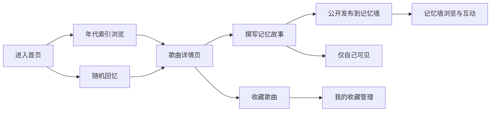

## 1. 产品概述

"8090音乐记忆系统"是一款面向80后、90后怀旧人群的音乐记忆社区产品，通过经典歌曲唤起时代回忆，让用户记录并分享与音乐相关的个人故事。

- 核心价值：以音乐为情感载体，连接时代记忆与个人故事
- 目标用户：80后、90后怀旧人群，寻找青春回忆的音乐爱好者

## 2. 核心功能

### 2.1 用户角色

| 角色 | 注册方式 | 核心权限 |
|------|----------|----------|
| 访客用户 | 无需注册 | 浏览歌曲、年份索引、记忆墙公开内容 |
| 注册用户 | 本地昵称注册 | 收藏歌曲、撰写记忆故事、发布到记忆墙、点赞互动 |

### 2.2 功能模块

1. **首页**：Hero氛围区、快速导航、随机回忆按钮、精选记忆
2. **年代索引页**：按1980-1999年份展示经典歌曲列表，可按年份筛选
3. **歌曲详情页**：歌曲信息、歌词、用户记忆故事展示、收藏与撰写故事入口
4. **我的收藏页**：用户收藏的歌曲与个人记忆故事管理
5. **记忆墙（社区）**：时间线式展示所有用户公开的记忆故事，支持点赞互动

### 2.3 页面详情

| 页面名称 | 模块名称 | 功能描述 |
|----------|----------|----------|
| 首页 | Hero氛围区 | 怀旧渐变背景、年代标语、动态黑胶唱片动效、进入系统CTA |
| 首页 | 快速导航 | 年份时间轴快速跳转、功能入口卡片（年代/收藏/记忆墙） |
| 首页 | 随机回忆 | "随机回忆"按钮，点击后随机展示一首经典歌曲+相关故事 |
| 首页 | 精选记忆 | 轮播展示记忆墙精选内容 |
| 年代索引页 | 年份选择器 | 1980-1999横向滚动年份条，当前年份高亮 |
| 年代索引页 | 歌曲列表 | 卡片式歌曲展示，含歌名、歌手、专辑封面、年代标签、收藏状态 |
| 歌曲详情页 | 歌曲信息 | 专辑封面、歌名、歌手、年份、歌词展示 |
| 歌曲详情页 | 记忆故事区 | 展示其他用户的记忆故事列表 |
| 歌曲详情页 | 撰写故事 | 弹窗表单，输入故事内容、选择公开/私密 |
| 我的收藏页 | 收藏列表 | 已收藏歌曲，可查看/编辑个人故事、取消收藏 |
| 记忆墙页 | 故事时间线 | 瀑布流/卡片式展示所有公开记忆，含歌曲、故事、作者、时间、点赞数 |
| 记忆墙页 | 互动功能 | 点赞按钮、筛选（最新/最热/按年代） |

## 3. 核心流程

用户进入首页 → 通过年代索引或随机回忆发现歌曲 → 浏览歌曲详情与他人故事 → 收藏歌曲并撰写个人记忆 → 在记忆墙分享与互动。

## 4. 用户界面设计

### 4.1 设计风格

- **主色调**：深棕褐色 `#3E2723`（复古木纹色）、暖金色 `#D4AF37`（岁月鎏金）、米黄色 `#F5E6C8`（旧纸张色）
- **辅助色**：砖红 `#B7410E`、墨绿 `#2F4538`
- **按钮风格**：圆角复古按钮，带细微木纹纹理与金色边框，悬停时有轻微上浮动效
- **字体**：标题使用衬线字体 "Playfair Display" / "Noto Serif SC"（中文），正文使用 "Lora" / "思源宋体"，营造旧杂志/书籍质感
- **布局风格**：卡片式布局，带做旧纸张纹理背景，细微噪点叠加，复古装饰边框
- **图标风格**：线性+填充结合的复古风格图标，采用 lucide-react 并统一暖金色调
- **整体氛围**：旧唱片店、老式收音机、泛黄相册的怀旧质感

### 4.2 页面设计概览

| 页面名称 | 模块名称 | UI元素 |
|----------|----------|--------|
| 首页 | Hero区 | 大标题衬线字体、旋转黑胶唱片动画、渐变+噪点背景、金色CTA按钮 |
| 年代索引页 | 年份条 | 横向滚动、选中年份放大高亮、年代分隔（80s/90s） |
| 年代索引页 | 歌曲卡片 | 专辑封面（圆角+阴影）、歌名衬线字体、歌手小字、年代标签徽章 |
| 歌曲详情页 | 主视觉 | 大幅专辑封面（做旧效果）、歌词居中排版、垂直分隔线 |
| 我的收藏页 | 收藏列表 | 可展开卡片，展开显示个人故事编辑区 |
| 记忆墙页 | 故事卡片 | 瀑布流布局、作者头像（复古圆形边框）、故事引用样式、点赞心形 |

### 4.3 响应式

- Desktop-first 设计，在 1280px 以上宽度呈现最佳效果
- 平板（768-1024px）：年份条纵向改为可折叠、歌曲卡片两列
- 移动端（<768px）：单列布局、简化动画、底部Tab导航
- 所有交互支持触摸操作

