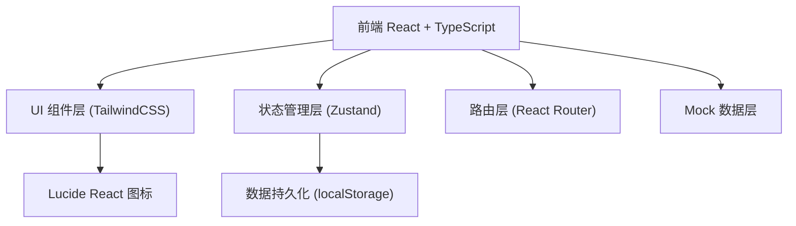
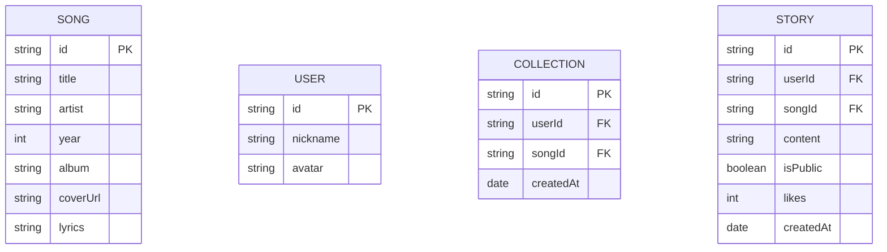

## 1. 架构设计

## 2. 技术说明

- **前端**：React@18 + TypeScript + Vite
- **样式**：TailwindCSS@3（自定义怀旧主题配色）
- **状态管理**：Zustand（轻量级 store，管理收藏、用户、记忆故事）
- **路由**：react-router-dom
- **图标库**：lucide-react
- **数据持久化**：localStorage（收藏、故事、用户数据本地存储）
- **初始化工具**：vite-init
- **后端**：无（纯前端 SPA，所有数据使用 Mock 数据 + localStorage）

## 3. 路由定义

| 路由 | 用途 |
|------|------|
| `/` | 首页：Hero 区域、快速导航、随机回忆、精选记忆 |
| `/timeline` | 年代索引页：按 1980-1999 年份浏览经典歌曲 |
| `/song/:id` | 歌曲详情页：歌曲信息、歌词、记忆故事 |
| `/collection` | 我的收藏页：管理收藏的歌曲与个人故事 |
| `/memory-wall` | 记忆墙：浏览所有公开记忆故事、互动 |

## 4. 数据模型

### 4.1 数据模型定义

### 4.2 Mock 数据设计

- **songs.ts**：预置 1980-1999 年代约 80-100 首经典华语歌曲数据，含歌名、歌手、年份、专辑、封面 URL、歌词片段
- **stories.ts**：预置 15-20 条示例记忆故事，包含不同用户、不同年代、不同歌曲的故事内容
- **users.ts**：预置若干示例用户（昵称+头像）

### 4.3 Zustand Store 设计

- `useUserStore`：当前用户信息、设置昵称
- `useCollectionStore`：收藏列表、添加/取消收藏、持久化到 localStorage
- `useStoryStore`：记忆故事列表、添加故事、点赞、按歌曲/用户筛选

